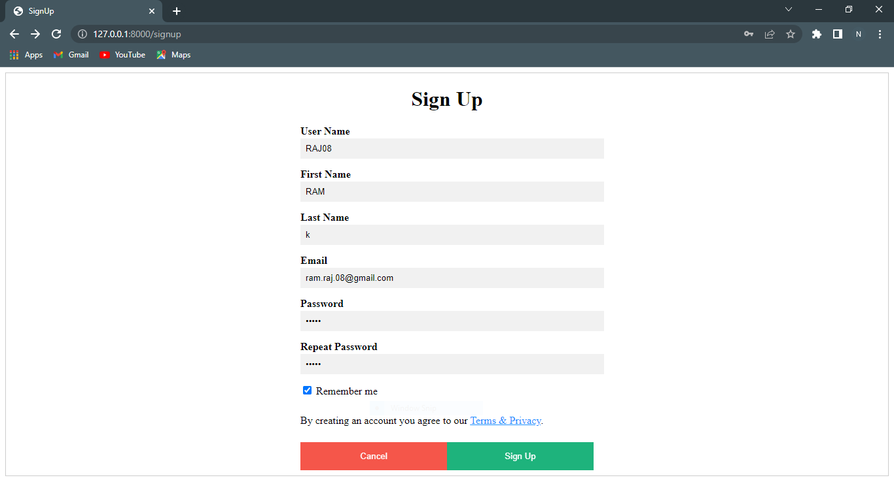

# Simple-Login-page-Django
This is a Simple Login page which is done using Django

 

#### This is  the Home page which has Signin and Sigup Buttons 

- The Button Signup directs to a signup page where new user is created and stored and it redirects to the home page 

 

- The user can now login with his credentials 

 

- After the login this page is displayed 

 
